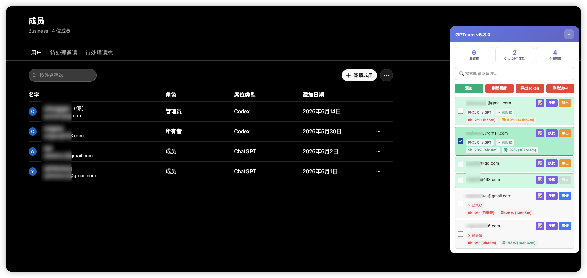

# GPTeam - ChatGPT Team 管理增强工具


一个功能强大的 Tampermonkey 脚本，用于增强 ChatGPT Team 的成员管理、OAuth 授权、Token 管理和额度查询功能。

## 📸 界面预览



## ✨ 核心功能

### 1. 🔐 OAuth 授权管理
- **Codex OAuth 流程**: 完整的 OAuth 2.0 PKCE 授权流程实现
- **自动授权**: 邀请成员后自动触发授权流程
- **Token 管理**: 自动存储和管理 access_token、refresh_token、id_token
- **状态跟踪**: 实时跟踪授权状态（已授权/已失效）
- **安全验证**: 邮箱匹配验证，防止授权错误

### 2. 👥 成员管理
- **批量添加**: 支持多行、逗号、分号分隔的批量邮箱导入
- **快速邀请**: 一键复制邮箱并自动填充邀请表单
- **移出成员**: 自动化移出流程（保护所有者账户）
- **状态同步**: 自动检测和同步成员加入状态
- **席位跟踪**: 实时显示 ChatGPT 席位分配情况
- **角色识别**: 自动识别所有者和成员角色

### 3. 📊 额度查询与监控
- **实时额度**: 查询 ChatGPT 使用额度（5小时窗口 + 周窗口）
- **智能刷新**: 自动刷新超过 2 分钟未更新的额度
- **可视化显示**: 颜色编码显示额度状态（绿/黄/红）
- **重置倒计时**: 显示额度重置剩余时间
- **批量刷新**: 一键刷新所有已授权账户的额度

### 4. 📤 Token 导出
- **灵活导出**: 支持复制到剪贴板或下载为 JSON 文件
- **批量操作**: 选中多个账户批量导出
- **完整数据**: 包含 Token、额度、授权时间等完整信息
- **格式化输出**: JSON 格式，易于集成和使用


### 5. 🤖 自动化功能
- **自动同步**: 每 5 秒自动同步成员状态
- **自动授权**: 邀请成功后自动触发 OAuth 授权
- **跨页面标记**: 在 auth.openai.com 标记最近复制的邮箱
- **智能提醒**: 席位超限时弹窗确认
- **今日统计**: 显示今日已使用的 ChatGPT 席位数

## 🚀 安装使用

### 前置要求
1. 安装 [Tampermonkey](https://www.tampermonkey.net/) 浏览器扩展
2. 拥有 ChatGPT Team 管理员权限

### 安装步骤
1. 打开 Tampermonkey 管理面板
2. 点击 "+" 创建新脚本
3. 复制 `gpteam-tampermonkey.user.js` 的完整内容
4. 粘贴到编辑器并保存
5. 访问 `https://chatgpt.com/admin/members` 即可看到管理面板

## 📖 使用指南

### 基础操作

#### 添加成员
1. 点击面板上的 **"添加"** 按钮
2. 输入邮箱（支持单个或多个，多个用换行/逗号/分号分隔）
3. 点击确定

#### 邀请成员
1. 找到待邀请的邮箱
2. 点击 **"邀请"** 按钮
3. 脚本会自动：
   - 复制邮箱到剪贴板
   - 打开邀请弹窗
   - 填充邮箱
   - 发送邀请
   - 触发 OAuth 授权

#### OAuth 授权
1. 点击邮箱旁的 **"授权"** 按钮
2. 在弹出的授权窗口中登录对应账户并完成授权
3. 授权后浏览器会自动跳转到 `localhost:1455`（该地址无法访问，这是正常的）
4. 复制浏览器地址栏的**完整 URL**（格式：`http://localhost:1455/auth/callback?code=...&state=...`）
5. 粘贴到脚本弹出的输入框中
6. 脚本自动验证并完成 Token 交换

#### 查询额度
- **单个刷新**: 授权后自动查询
- **批量刷新**: 点击 **"刷新额度"** 按钮
- **自动刷新**: 超过 2 分钟未更新时自动刷新

#### 导出 Token
1. 勾选需要导出的账户
2. 点击 **"导出Token"** 按钮
3. 选择 **"复制"** 或 **"下载"**

### 统计信息
- **总邮箱**: 管理的所有邮箱数量
- **ChatGPT 席位**: 当前分配了 ChatGPT 席位的账户数
- **今日已用**: 今日已使用过 ChatGPT 席位的账户数

### 额度显示
- **5h**: 5 小时滚动窗口的剩余额度百分比
- **周**: 周滚动窗口的剩余额度百分比
- 颜色含义：
  - 🟢 绿色：> 70%
  - 🟡 黄色：30% - 70%
  - 🔴 红色：< 30%

### 账户状态
- **已加入**: 成员已在团队中
- **待加入**: 邮箱已添加但未邀请或未接受邀请
- **✓ 已授权**: OAuth 授权成功，Token 有效
- **✗ 已失效**: Token 已过期，需要重新授权

## 🔧 技术实现

### 核心技术
- **OAuth 2.0 PKCE**: 安全的授权码流程
- **GM_xmlhttpRequest**: 跨域 API 请求
- **GM_setValue/GM_getValue**: 持久化数据存储
- **手动回调处理**: 用户粘贴回调 URL 完成授权流程

### 数据结构
```javascript
{
  email: "user@example.com",           // 邮箱地址
  addedAt: "2024-01-01T00:00:00.000Z", // 添加时间
  joinedAt: "2024-01-01T01:00:00.000Z",// 加入时间
  status: "joined",                     // 状态: joined/pending
  seatType: "ChatGPT",                  // 席位类型
  lastGptSeatAt: "2024-01-01T...",     // 最后分配 ChatGPT 席位时间
  role: "成员",                          // 角色: 所有者/成员
  note: "备注信息",                      // 备注
  codexTokens: {                        // Token 信息
    access_token: "...",
    refresh_token: "...",
    id_token: "...",
    authorized_at: "2024-01-01T...",
    status: "authorized",               // authorized/expired
    quota: {                            // 额度信息
      hourly_percentage: 85.5,          // 5小时剩余百分比
      weekly_percentage: 92.3,          // 周剩余百分比
      hourly_reset_time: 1234567890,    // 5小时重置时间戳
      weekly_reset_time: 1234567890     // 周重置时间戳
    },
    quota_updated_at: "2024-01-01T..."  // 额度更新时间
  }
}
```

## 🛡️ 安全说明

### 数据安全
- 所有数据存储在浏览器本地（Tampermonkey 存储）
- Token 仅存储在本地，不会上传到任何服务器
- 支持邮箱匹配验证，防止授权错误账户

### 使用建议
- 定期备份导出的 Token 数据
- 不要将 Token 分享给他人
- Token 过期后需要重新授权
- 建议在私密环境下使用

## ⚠️ 注意事项

1. **授权流程**: OAuth 授权需要在对应账户登录的浏览器中完成
2. **席位限制**: ChatGPT 席位有限制，脚本会在超限时弹窗提醒
3. **Token 有效期**: Token 会过期，过期后需要重新授权
4. **所有者保护**: 不能移出所有者角色的账户
5. **页面刷新**: 授权成功后会自动刷新页面以识别新成员
6. **浏览器兼容**: 建议使用 Chrome、Edge、Firefox 等现代浏览器


## 🤝 贡献

欢迎提交 Issue 和 Pull Request！

## 📄 许可证

MIT License

## 👨‍💻 作者

xcg

---

**免责声明**: 本工具仅供学习和研究使用，使用者需遵守 OpenAI 的服务条款。因使用本工具产生的任何问题，作者不承担责任。
